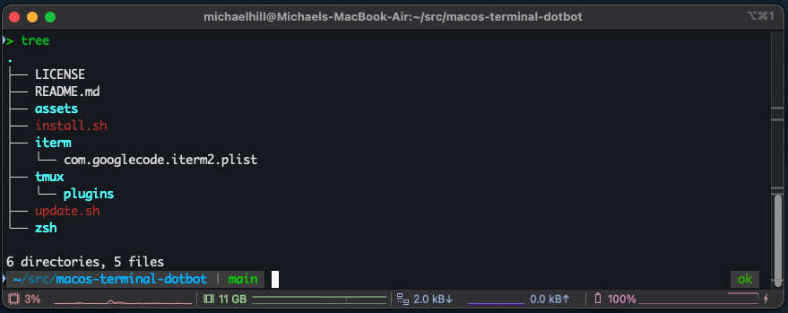

# 💻 macOS Terminal DotBot

A clean, portable terminal environment using iTerm2 + OhMyZsh + Powerlevel10k + Tmux.

## 🖼️ Terminal Preview



---

## 🧰 Features
- iTerm2 theme + settings
- Zsh with Oh My Zsh and Powerlevel10k
- Tmux with TPM and plugin support
- One-command install on a new machine
- Easy syncing of your local setup via `update.sh`

---

## 🚀 Quick Start

### 1. Install on a New Machine
```bash
git clone https://github.com/infra-by-michaelhill/macos-terminal-dotbot.git
cd macos-terminal-dotbot
chmod +x install.sh
./install.sh
```

### 2. Sync from Your Current Machine (Can fork -> push to allow remote storage via GitHub)
```bash
cd macos-terminal-dotbot
chmod +x ./update.sh
./update.sh
```